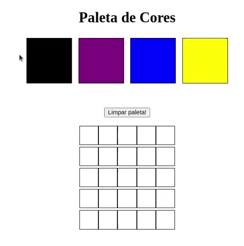

# Projeto Pixels Art

- Terceiro projeto feito no módulo de fundamentos da Trybe. O projeto consiste em criar uma página web que contém uma paleta de cores funcional que poderá ser utilizada para criar desenhos em pixels. 

## Tecnologias Utilizadas

- HTML;
- CSS;
- Javascript;
